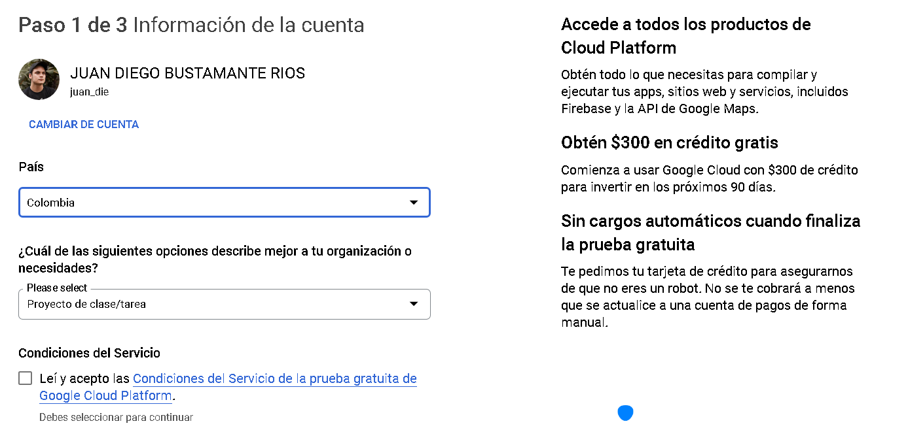
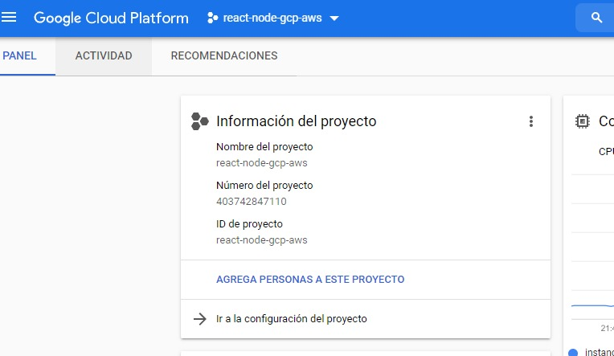
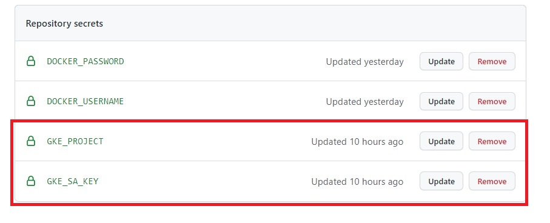
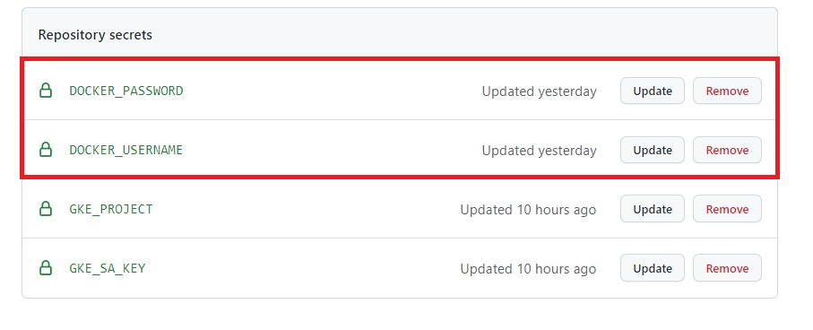

# Multi-Cloud application Google Cloud Platform & Amazon Web Services
Este repositorio hace parte de la implementación de una aplicación web Multi-cloud basada en react.js y node.js, que utiliza los servicios de 
[Google Cloud Platform (GCP)](https://console.cloud.google.com/getting-started) para desplegarse en la web y se conecta a una base de datos alojada en el Servicio 
de base de datos relacional [(RDS)](https://aws.amazon.com/es/rds/) de [Amazon Web Services (AWS)](https://aws.amazon.com/es/) utilizando el motor de base de datos [MySQL](https://www.mysql.com/)
y que por medio de [GitHub Actions](https://github.com/features/actions) actualiza, construye y lanza automaticamente la aplicación en producción.
## 🟩Guía paso a paso para la reproducción de la solución.
Para reproducir la solución se tienen que tener en cuenta los siguientes pasos.

### 1. Realizar un Fork al repositorio [jcamiloguz/react-node-gcp-aws.](https://github.com/jcamiloguz/react-node-gcp-aws)
  - En la página principal de este repositorio, en la esquina superior derecha se encuentra la opción de crear un fork a partir de éste, esto permite crear una copia de él que será propia y podremos hacer cambios sin afectar el repositorio original.  
  - Al crear un fork nos aparecerá esta ventana de carga indicando que se está creando un fork correctamente. 
  - Al terminar, ya se contaría con un fork del repositorio original, durante el resto de la guía paso a paso se hará referencia a éste nuevo fork.
### 2. Crear cuenta en [Google Cloud Platform (GCP)](https://console.cloud.google.com/getting-started).
  - Al acceder a la página de [Google Cloud Platform (GCP)](https://console.cloud.google.com/getting-started) se presenta el botón de probar gratis, el cuál permitirá empezar el registro a la plataforma de Google Cloud 
    
  - Para el paso anterior se debe tener una sesión iniciada de Google, en caso tal de no estarlo aparecerá esta ventana permitiendo iniciar sesión o en dado caso de no tener una cuenta de google, [crearla](https://accounts.google.com/signup/v2/) _(Se recomienda utilizar una cuenta institucional)_
    
  - Para terminar el registro en **Google Cloud Platform**, la página pide otros datos, como la región, la razón a utilizar (en este caso, proyecto), tipo de cuenta (en este caso Persona) y un medio de pago (No se harán facturaciones a menos que el usuario active la facturación automática).
    
### 3. Creación de Clúster utilizando Google Kubernetes Engine en **Google Cloud Platform**.
  - A continuación con el [Google Kubernetes Engine](https://cloud.google.com/kubernetes-engine) se crea un Clúster de tipo Load Balancer de Kubernetes que soportará la aplicación web montada.
### 4. Creación de los **secrets** del proyecto en GitHub de las credenciales de Google Cloud Platform.
  - En el aparatado de **Settings** o configuraciones del Fork que se creó en el [punto 1](https://github.com/jcamiloguz/react-node-gcp-aws#1-realizar-un-fork-al-repositorio-jcamiloguzreact-node-gcp-aws), en la pestaña de secrets, se pueden crear los secrets que actuarán como variables de entorno necesarias para crear la conexión de la aplicación con el Clúster de Kubernetes.
    
  - Se deben crear dos secrets para el funcionamiento de la aplicación, deben llevar los nombres de: **GKE_PROJECT*** y **GKE_SA_KEY**, es importante copiar correctamente los nombres de estos secrets y sus valores correspondientes, para aclarar mejor esta información se presenta la siguiente tabla como guía. 

| Nombre secret | Valor |
| ------------- | ------------- |
| GKE_PROJECT  | id del proyecto creado en GKE  |
| GKE_SA_KEY  | Llave de seguridad del proyecto en GKE   |

  - Estos valores se pueden encontrar en las configuraciones del Clúster creado en el [punto 3](https://github.com/jcamiloguz/react-node-gcp-aws#3-creaci%C3%B3n-de-cl%C3%BAster-utilizando-google-kubernetes-engine-en-google-cloud-platform) como muestra la siguiente imagen:
    
  - El resultado de este paso debe ser similar a esto:
    
### 5. Inicio del Clúster y obtebción de IP externa.
  - Se inicializa la instancia del Cluster y se obtiene la ip externa con la que se accede a la aplicación. (Tener en cuenta el puerto 9000)

## 🟨Guía paso a paso funciones adicionales (Opcionales).
A  continuación se presenta una guía paso a paso para llevar a cabo las siguientes funciones adicionales del proyecto:
- Montaje en Docker Hub.
- Montaje base da datos propia de Amazon Web Services (AWS).
### 1. Creación de cuenta en Docker Hub.
- Para esto se ingresa a [Docker Hub](https://hub.docker.com/) y en la pantalla principal está el formulario para crear una cuenta, ingresar el Docker ID, un correo electrónico y la contraseña
   
- Una vez creada la cuenta tener en cuenta **(DOCKER ID)** y **(Password)**, estos valores se necesitarán para la creación de los **secrets**.
### 2. Creación de los **secrets** del proyecto en Github de las credenciales de Docker Hub.
- Al igual que en el [punto 4](https://github.com/jcamiloguz/react-node-gcp-aws#4-creaci%C3%B3n-de-los-secrets-del-proyecto-en-github-de-las-credenciales-de-google-cloud-platform) de la guía anterior se repite el mismo proceso de acceder a **Settings** y a **Secrets** para crear dos nuevos secretos relacionados con las credenciales de docker, deben llevar los nombres: **DOCKER_USERNAME** y **DOCKER_PASSWORD, estos datos son resultado del punto anterior, igualmente puede tomar la siguiente tabla como gúia. 

| Nombre secret | Valor |
| ------------- | ------------- |
| DOCKER_USERNAME  | Docker id   |
| DOCKER_PASSWORD  | Contraseña de la cuenta docker    |

- El resultado de este paso debe ser similar a esto:
  

### 3. Creación de la cuenta en **AWS**.
- Este paso es similar al [punto 2](https://github.com/jcamiloguz/react-node-gcp-aws#2-crear-cuenta-en-google-cloud-platform-gcp) de la guía anterior, pero esta vez se creará una cuenta de capa gratuita accediendo a la [plataforma de Amazon Web Services](https://www.google.com/aclk?sa=L&ai=DChcSEwjEoeXxpo70AhVCsYYKHQbCDgMYABABGgJ2dQ&ae=2&sig=AOD64_2XCxJ0ut9nQFwPSdHuyIbp_1UHNw&q&adurl&ved=2ahUKEwjs-tzxpo70AhXiTDABHa3LA1UQ0Qx6BAgDEAE), al dar click sobre **crear una cuenta gratuita** se desplegará la siguiente interfaz para comenzar con la creación de la cuenta:
  
- Se pedirán datos como la región, el propósito de la cuenta, número celular y datos de facturación (Al igual que con **Google Cloud Platform** todo se trabaja sobre la capa gratuita y no se harán cobros a menos de que se utilicen servicios fuera de esta capa)
### 4. Creación de la base de datos en el **Servicio de Base de Datos Relacional** de **AWS**.
### 5. Actualización de las credenciales de la base de datos creada.
